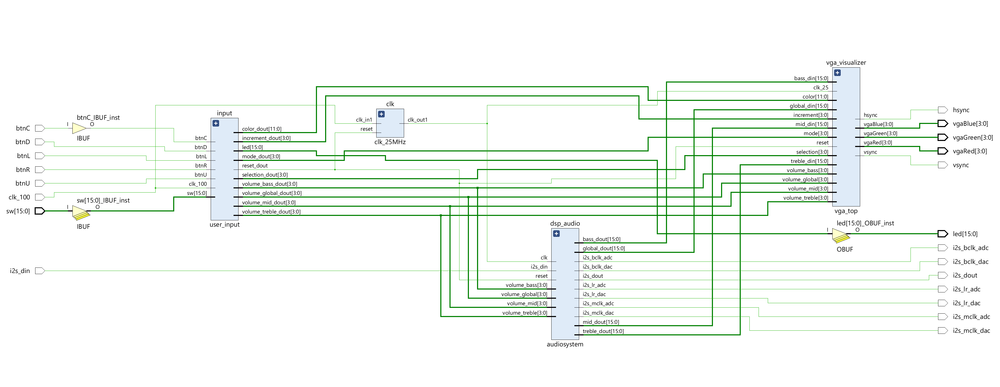
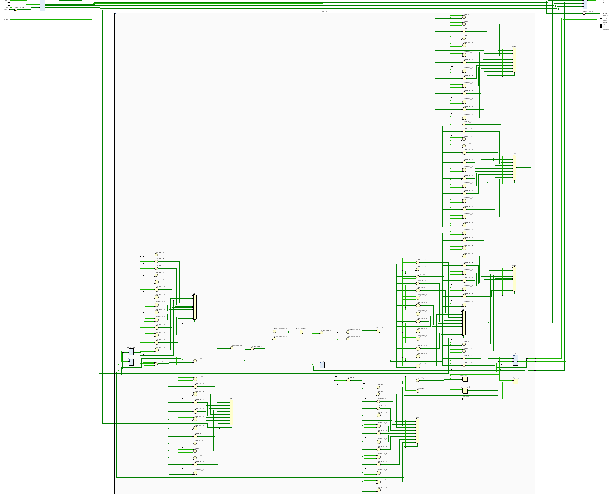
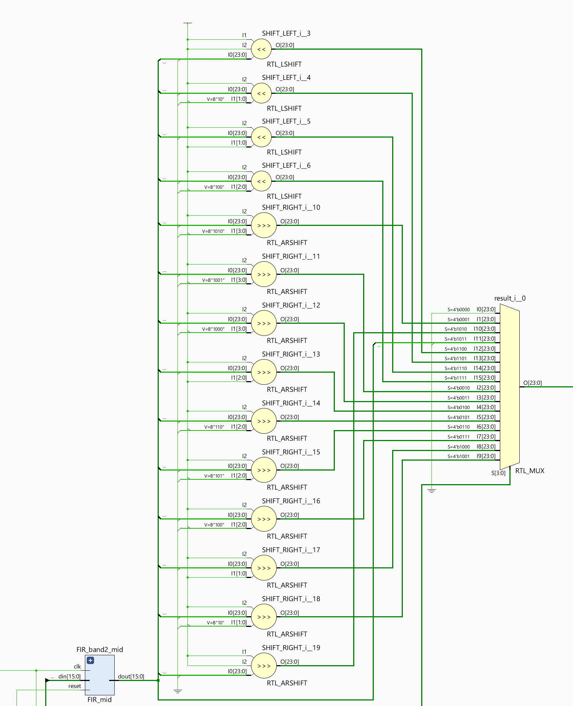
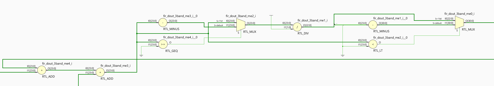
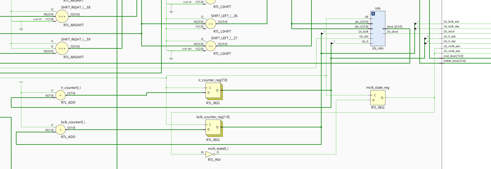
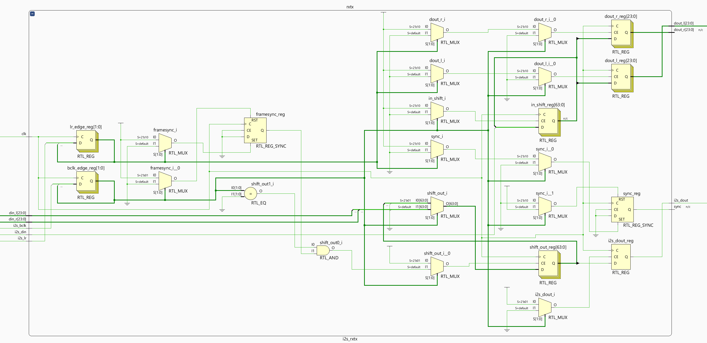

# Digital Signal Processing

## Table of Contents

1. **[Introduction](#introduction)**

2. **[Explaining the Functionality](#explaining-the-functionality)**

3. **[Troubleshooting](#troubleshooting)**

## Introduction

TO DO

### Components

- Digital Signal Processing (audiosystem.vhd)
  - I2S Receiver/Transmitter (i2s_rxtx.vhd)
  - Audio Band 1 - Bass: Lowpass FIR filter using DSP48E1 slices. (FIR_bass.vhd)
  - Audio Band 2 - Midrange: Bandpass FIR filter using DSP slices. (FIR_mid.vhd)
  - Audio Band 3 - Treble: Bandpass FIR filter using DSP slices. (FIR_treble.vhd)

*Elaborated Design Schematic Entire Project in Vivado*

The following schematic is too large the view, so following it are zoomed in parts of the schematic.

*Elaborated Design Schematic of DSP/Audiosystem Vivado*

###### Part: FIR Filter Block and Volume Control

*Elaborated Design Schematic of DSP/Audiosystem Part Filter followed by Volume Control in Vivado*

###### Part: 3 Band to Median

*Elaborated Design Schematic of DSP/Audiosystem Part: 3 Band to Median Vivado*

###### Part: Output

*Elaborated Design Schematic of DSP/Audiosystem Part: Output Vivado*

##### FIR Filter

*Elaborated Design Schematic of FIR Filter Vivado*

*Elaborated Design Schematic of FIR Filter Start Vivado*

*Elaborated Design Schematic of FIR Filter End Vivado*

##### I2S2 Receiver/Transmitter

*Elaborated Design Schematic of I2S2 Receiver/Transmitter Vivado*

## Explaining the Functionality

*Reproduceerbaarheid / Tutorial achtige uitleg zoals de slides van de cursus.*

TO DO

## Troubleshooting

*Ervaarde moeilijkheden / gevonden oplossingen*

TO DO
