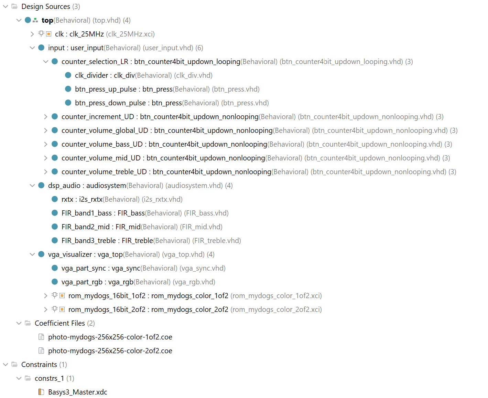

# Project Overview

## Table of Contents

1. **[Introduction](#introduction)**

2. **[Development Plan](#development-plan)**

3. **[Testing Plan](#testing-plan)**

4. **[Future Development](#future-development)**

---

## Introduction

This is a student project made for the course Digital Systems Development at AP University of Applied Sciences and Arts Antwerp.
The aim of the assignment is to make a project that brings together different elements we have learned throughout the course and research some extra elements. This by utilizing and combining the different options the Digilent Basys 3 Artix-7 FPGA Trainer Board has to offer.

### Project Goals

The aim of this project is to build an audio equalizer and visualizer by utilizing the Basys3 board's DSP48E1 slices, ROM Block Memory, 12-bit VGA RGB444 output, Pmod port to connect an audio receiver/transmitter, and the basic I/O in the form of switches, leds and pushbuttons on the board itself.
Audio is sampled throught the Digilent Pmod I2S2 of which a single channel is put through three band FIR filters using the DSP slices. The resulting three bands (bass, midrange and treble) can be individually shifted in volume/amplitude. Afterwards they are combined into one output signal, which can also be shifted in volume/amplitude, to finally be transmitted to a speaker through the Pmod I2S2.
These four signals are also send too the VGA driver to be visualized.
As an extra to test the VGA and ROM Block Memory functionality the visualizer has a photo background and some basic image processing.

---

## Development Plan

The project is split up into three parts:

1. **User Inputs**: processing switch state changes and button presses and translating them into usable data.
2. **Digital Signal Processing**: sampling the audio, filtering the samples through FIR filters using DSP slices and transmitting the results to the VGA Visualizer and back out to a speaker.
3. **VGA Visualizer**: visualizing the filtered audio signals using the VGA output, reading from ROM Block Memory, and some basic image processing.

The actual development is done in reversed order to more easily verify the correct workings through visuals.

### Components of the project

#### External/Hardware Components

- [Digilent Basys 3 Artix-7 FPGA Trainer Board](https://digilent.com/shop/basys-3-artix-7-fpga-trainer-board-recommended-for-introductory-users/) (middle block) featuring the Xilinx Artix-7 FPGA XC7A35T-1CPG236C, part number: xc7a35tcpg236-1
- [Digilent Pmod I2S2](https://digilent.com/reference/pmod/pmodi2s2/reference-manual) (left side block) stereo audio receiver/transmitter featuring a [Cirrus CS5343 Multi-Bit Audio A/D Converter](https://www.cirrus.com/products/cs5343-44/) and a [Cirrus CS4344 Stereo D/A Converter](https://www.cirrus.com/products/cs4344-45-48/).
- Monitor with VGA port (right side block)

#### Internal Components

- 25MHz Clock: providing a 25MHz (25,175 MHz) clock for 60Hz (59,940 Hz) 640x480px VGA output.(Clocking Wizard IP)
- User Inputs (user_input.vhd)
  - 6x Button press with 4-bit counter: up/down; looping and non-looping. (btn_counter4bit_updown_looping/nonlooping.vhd)
    - Clock divider: 100MHz to 100Hz for button debouncing. (clk_div.vhd)
    - Button press detector: provides a single rising edge pulse when button is pressed and held down. (btn_press.vhd)
- Digital Signal Processing (audiosystem.vhd)
  - I2S Receiver/Transmitter (i2s_rxtx.vhd)
  - Audio Band 1 - Bass: Lowpass FIR filter using DSP48E1 slices. (FIR_bass.vhd)
  - Audio Band 2 - Midrange: Bandpass FIR filter using DSP slices. (FIR_mid.vhd)
  - Audio Band 3 - Treble: Bandpass FIR filter using DSP slices. (FIR_treble.vhd)
- VGA Visualizer (vga_top.vhd)
  - Synchronization: providing the correctly timed synchronization for a 60Hz 640x480px VGA monitor. (vga_sync.vhd)
  - Visuals: reading inputs and ROM, and deciding the visuals to output. (vga_rgb.vhd)
  - 2x ROM: holds a 256x256px (16-bit address) RGB332 (2xHEX = 16-bit coefficients) photo split up in two seperate files. (Block Memory IP)

### Phases

1. The first phase is to research the different components and to gather resources and IP.
2. The second phase is to test the individual components and make sure they all work separately.
3. The third and last phase is to bring everything together to a working whole using the top file.

### Used Software

- Vivado 2019.2 for FPGA development in VHDL.
- MATLAB R2021b for filter designing.
- [Coefficient Translator by Dimitar H. Marinov aka DHMarinov](https://github.com/DHMarinov/Coefficient-Translator) to translate floating point filter coefficients from MATLAB too HEX VHDL code.
- Adobe Photoshop 2023 for photo editing.
- [coetool by Javier Quintano Merino aka jaXvi (2014)](http://jqm.io/files/coetool/) to translate a 24- or 32-bit bitmap image to a 16-bit RGB332 (3-bit Red, 3-bit Green and 2-bit Blue channels) coefficient file that can be used in Block Memory on an FPGA.

---

## Testing Plan

The testing will be done by building or resourcing the necessary components and first testing them individually to verify their proper functioning.

After all components have been verified are connected one by one together through the top component. After each addition the whole is tested to identify problems early on where possible.

Testing and validation is done in the following steps:

1. Using the RTL Analysis: Elaborated Design schematic
   This gives a clear and readable overview of all the inputs, blocks, signals and outputs defined in the VHDL code.
2. Logs and Messages in Vivado when running Synthesis, Implementation and Generate Bitstream.
3. Schematics and Utilization info from Synthesis and Implementation.
4. Programming the board to test the actual functioning of the code. I choose to do this first when the hardware is available because simulations don't always represent the workings on actual hardware. Simulating audio and visuals can also be challanging, and the results don't necessary tell you how, for example, an image looks like on screen.
5. If the result of the previous step is unexpected, running simulations to verify and troubleshoot by visualizing signals. This allows to visualize the timing of signals and verify if you get the signals you expect, and if not, how they differ.

---

## Future Development

- Try different types of filters that need less coefficients and thus DSP slices to get better filtering of the bands.
- Add extra audio bands.
- Use a PS2 keyboard as user input instead of the boards built-in I/O.
- Use a Rotary Encoder Pmod as user interface.
