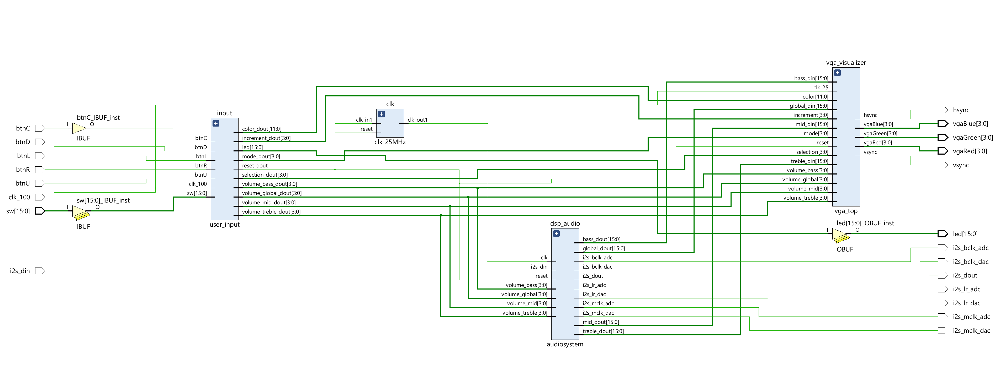
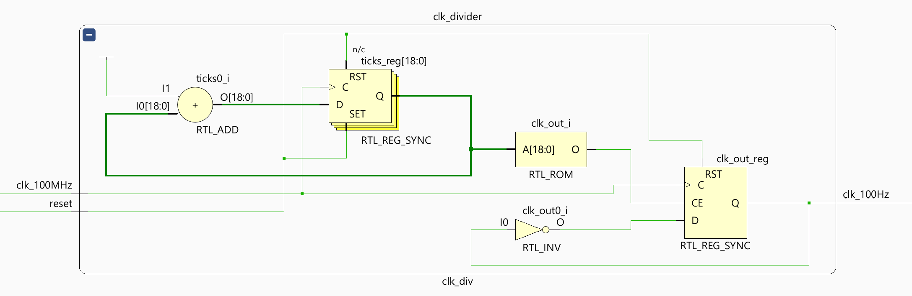
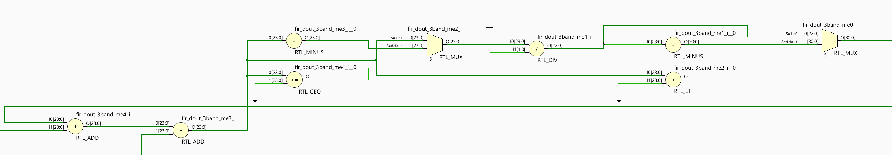
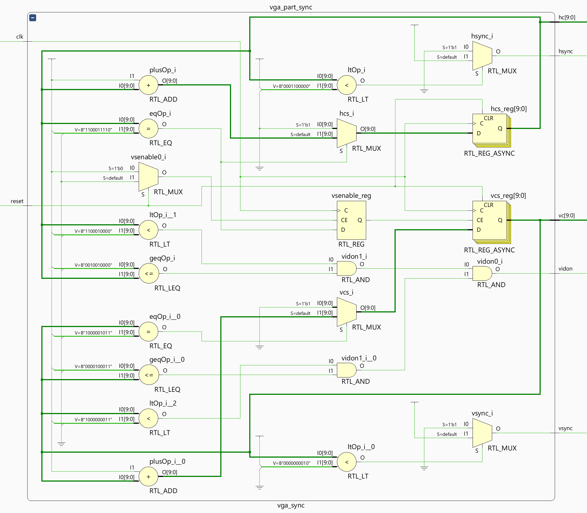
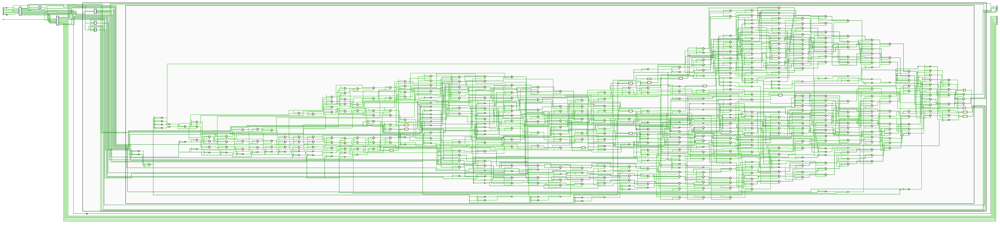
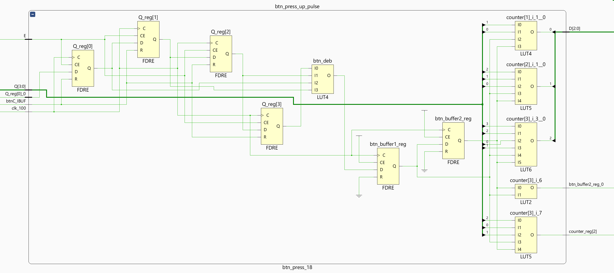

# End results

## Operation Instructions

---

## Media

---

## All Schematics

### Elaborated Design

*Elaborated Design Schematic in Vivado*

#### User Inputs

*Elaborated Design Schematic of User Inputs in Vivado*

##### Button Press 4-bit Counter

Counts up/down on a button press with a set maximum count. There is a looping and non-looping variant.

*Elaborated Design Schematic of 4-bit Looping Counter that counts up/down on button press, variant with maximum value, in Vivado*

*Elaborated Design Schematic of 4-bit Non-looping Counter that counts up/down on button press, no maxmimum value, in Vivado*

##### Components of the 4-bit Counter
- Button Press Detector that generates a signle rising edge pulse when a button is pressed/hold.
- Clock Divider from 100MHz to 100Hz to debounce the button press.

###### Button Press Detector

*Elaborated Design Schematic of Button Press Detector in Vivado*

###### Clock Devider 100MHz to 100Hz

*Elaborated Design Schematic of Clock Devider 100MHz to 100Hz in Vivado*

#### Digital Signal Processing

The following schematic is too large the view, so following it are zoomed in parts of the schematic.

*Elaborated Design Schematic of DSP/Audiosystem Vivado*

###### Part: FIR Filter Block and Volume Control

*Elaborated Design Schematic of DSP/Audiosystem Part Filter followed by Volume Control in Vivado*

###### Part: 3 Band to Median

*Elaborated Design Schematic of DSP/Audiosystem Part: 3 Band to Median Vivado*

###### Part: Output

*Elaborated Design Schematic of DSP/Audiosystem Part: Output Vivado*

##### FIR Filter

*Elaborated Design Schematic of FIR Filter Vivado*

*Elaborated Design Schematic of FIR Filter Start Vivado*

*Elaborated Design Schematic of FIR Filter End Vivado*

##### I2S2 Receiver/Transmitter

*Elaborated Design Schematic of I2S2 Receiver/Transmitter Vivado*

#### VGA Visualizer

*Elaborated Design Schematic of VGA Visualizer Vivado*

##### VGA Synchronization

*Elaborated Design Schematic of VGA Synchronization Vivado*

##### VGA Visuals

This schematic is too big to view, but can always be viewed in Vivado.

*Elaborated Design Schematic of VGA Visuals Vivado*

##### ROM Block Memory

*Elaborated Design Schematic of ROM Block Memory Vivado*

### Implementation

The Implementation schematic is very large. Too large to view easily.
The left section is mostly shift registers.
On the right are the three main components of the project.

*Implementation Schematic in Vivado*

###### Part Left: Shift Registers

*Implementation Schematic of Part Left: Shift Registers in Vivado*

#### User Inputs

The whole schematic is too much to show, it can always be viewed in Vivado, so here are only the the Block and two specific components.

*Implementation Schematic of User Inputs Block in Vivado*

###### Button Press Detector

*Implementation Schematic of Button Press Detector in Vivado*

###### Clock Devider 100MHz to 100Hz

*Implementation Schematic of Clock Devider 100MHz to 100Hz in Vivado*

#### Digital Signal Processing

The whole schematic is too much to show, it can always be viewed in Vivado, so here are only the the Block and FIR Filter parts.

*Implementation Schematic of DSP Block in Vivado*

##### FIR Filter using DSP48E1 slices

In the implementation schematic of the FIR filter it is clearly visible that the DSP48E1 slices are actually used. All three band filters use the same architecture. Only the coefficients used differ.

*Implementation Schematic of FIR Filter Block in Vivado*

###### Complete FIR Filter

*Implementation Schematic of Complete FIR Filter in Vivado*

###### DSP48E1 slices Start

*Implementation Schematic of DSP48E1 slices in FIR Filter Start in Vivado*

*Implementation Schematic of DSP48E1 slices in FIR Filter End in Vivado*

#### VGA Visualizer

The component schematics withing the VGA Visualizer are too big to show here and nothing special happens in them that is interesting to show here, so here are only the Blocks withing the main schematic.

*Implementation Schematic of VGA Block in Vivado*

*Implementation Schematic of VGA Visualizer in Vivado*

###### Right Part: VGA Synchronization

*Implementation Schematic of VGA Visualizer Part: VGA Synchronization in Vivado*

###### Left Part: VGA Visuals and ROM Block Memory

*Implementation Schematic of VGA Visualizer Part: VGA Visuals and ROM Block Memory in Vivado*

###### ROM Block Memory

*Implementation Schematic of VGA Visualizer ROM Block Memory in Vivado*
