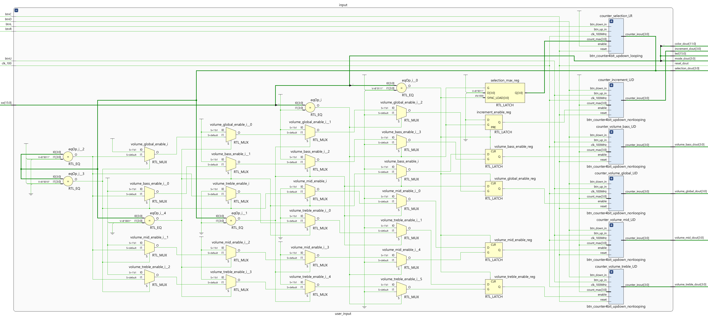
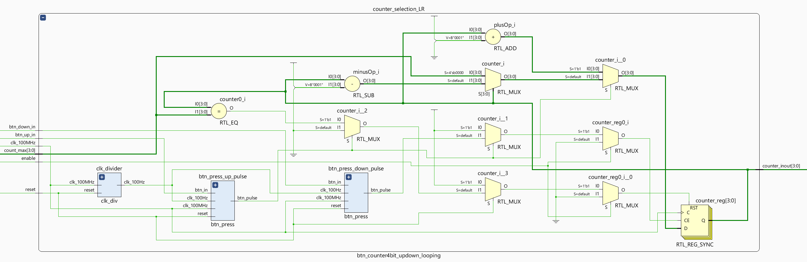
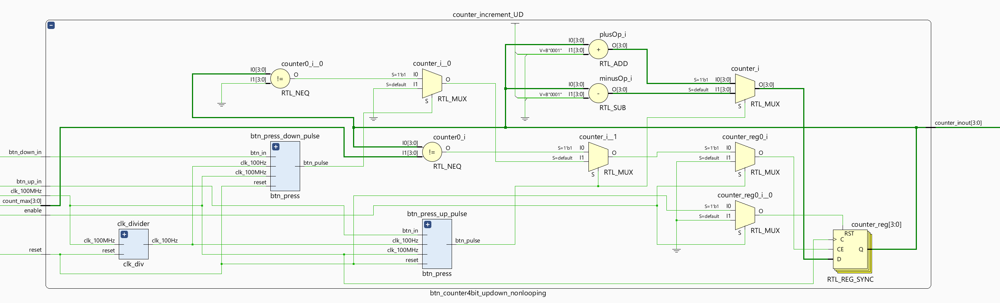
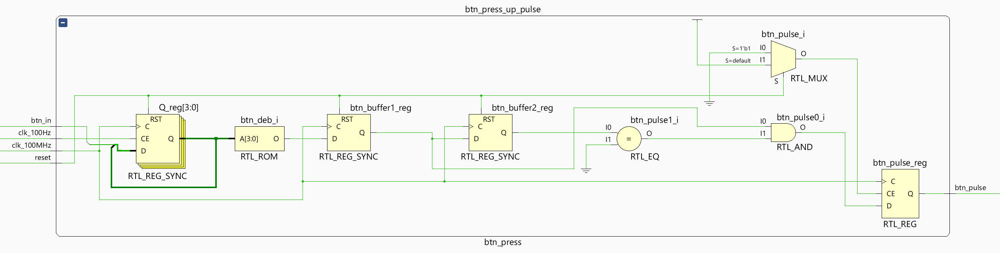
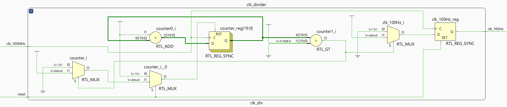
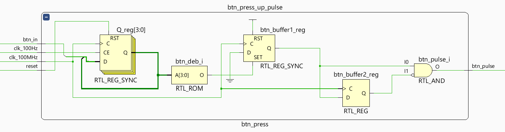

# User Inputs

## Table of Contents

1. **[Introduction](#introduction)**

2. **[Explaining the Functionality](#explaining-the-functionality)**

3. **[Troubleshooting](#troubleshooting)**

---


## Introduction

This section covers the User Inputs part of the project.
The aim of this part is to use the Basic I/O on the Digilent Basys 3 Artix-7 FPGA Trainer Board to allow the user to tell the VGA Visuals part what to show and control the volume of the audio and its three bands (bass, midrange and treble).

#### Controls

The controls are as follows:
- The user can set the VGA Visuals Mode (SW15-12) and 12-bit RGB444 background color (SW11-0) through the switches on the board. The selection being verified by the corresponding LED's above the switches.

- The Center button is the reset.

- The Left and Right buttons are used to make a selection within the set mode.

- While the Up and Down buttons are used to increase and decrease a parameter of the selection. Either the increment of an Image Processing type in Mode 3, or the volume in Mode 4.


*User Inputs with Basic I/O on FPGA Basys3 Board*

#### Visual Modes

The Visual Modes are:

0. Mode <= '0000' - Color: Only the background color.

1. Mode <= "0001" - Color Grid: A grid is shown on the screen to verify synchronization accuracy.

2. Mode <= "0011" - Color Palette: A color palette showing the color range of 12-bit RGB444, 4-bit Red channel, 4-bit Green channel and 4-bit Blue channel, the maximum amount of colors being available on VGA.

3. Mode <= "0111" - Image Processing: A photo read from ROM is shown with a couple of basic image processing types applied which can be cycled through with selection Left/Right buttons.

4. Mode <= "1111" - Audio Visualizer: Volume bars and the audio signals are shown with the photo read from ROM as background. Users can select the volume bars (Left/Right buttons) to increase or decrease the volume (Up/Down buttons).


### Components

- User Inputs (user_input.vhd)
  - 6x Button press with 4-bit counter: up/down; looping and non-looping. (btn_counter4bit_updown_looping/nonlooping.vhd)
    - Clock divider: 100MHz to 100Hz for button debouncing. (clk_div.vhd)
    - Button press detector: provides a single rising edge pulse when button is pressed and held down. (btn_press.vhd)


*Elaborated Design Schematic Entire Project in Vivado*



*Elaborated Design Schematic of User Inputs in Vivado*

##### Button Press 4-bit Counter

Counts up/down on a button press with a set maximum count. There is a looping and non-looping variant.



*Elaborated Design Schematic of 4-bit Looping Counter that counts up/down on button press, variant with maximum value, in Vivado*



*Elaborated Design Schematic of 4-bit Non-looping Counter that counts up/down on button press, no maxmimum value, in Vivado*

##### Components of the 4-bit Counter
- Button Press Detector that generates a signle rising edge pulse when a button is pressed/hold.
- Clock Divider from 100MHz to 100Hz to debounce the button press.

###### Button Press Detector


*Elaborated Design Schematic of Button Press Detector in Vivado*

###### Clock Devider 100MHz to 100Hz



*Elaborated Design Schematic of Clock Devider 100MHz to 100Hz in Vivado*


---

## Explaining the Functionality

The data set by the switches are easily read and written to the LED's and as outputs of the top file of this part `user_input.vhd` as shown below.

```vhdl
btnC : in STD_LOGIC;
sw : in STD_LOGIC_VECTOR (15 downto 0);
led : out STD_LOGIC_VECTOR (15 downto 0);
reset_dout : out STD_LOGIC;
color_dout : out STD_LOGIC_VECTOR (COLOR_WIDTH - 1 downto 0);

...

signal reset : STD_LOGIC;
signal mode : STD_LOGIC_VECTOR (MODE_WIDTH - 1 downto 0);
signal color : STD_LOGIC_VECTOR (11 downto 0);

...

reset <= btnC; -- Reset button
mode <= sw (15 downto 12);
color <= sw (11 downto 0);

...

led (11 downto 0) <= color;
led (15 downto 12) <= mode;

...

reset_dout <= reset;
mode_dout <= mode;
color_dout <= color;
```

The top file also handles the enables for the button counters, so that only the correct counter is enables depending on the *Mode* and *Selection* of the user.

```vhdl
counter_enables : process (mode, selection)
begin
    if mode = "0111" then
        selection_max <= selection_mode3_max;
        increment_enable <= '1';

        volume_global_enable <= '0';
        volume_bass_enable <= '0';
        volume_mid_enable <= '0';
        volume_treble_enable <= '0';

    elsif mode = "1111" then
        selection_max <= selection_mode4_max;
        increment_enable <= '0';

        if selection = "0000" then
            volume_global_enable <= '1';
            volume_bass_enable <= '0';
            volume_mid_enable <= '0';
            volume_treble_enable <= '0';

        elsif selection = "0001" then
            volume_global_enable <= '0';
            volume_bass_enable <= '1';
            volume_mid_enable <= '0';
            volume_treble_enable <= '0';

        elsif selection = "0010" then
            volume_global_enable <= '0';
            volume_bass_enable <= '0';
            volume_mid_enable <= '1';
            volume_treble_enable <= '0';

        elsif selection = "0011" then
            volume_global_enable <= '0';
            volume_bass_enable <= '0';
            volume_mid_enable <= '0';
            volume_treble_enable <= '1';

        end if;
    end if;
end process;
```

The more complex part here is having 4-bit counters that only counts once when a button is pressed or hold. To do this debouncing and edge detection is needed on the signal from the buttons. Otherwise mechanical bouncing of the buttons, as well as holding the button down to long (speaking in fractions of a second here depending on the clock frequency) will result in extra and unwanted counting. Furthermore, for this project, it is also required to have a looping and a non-looping counter, and being able to set a maximum count value the counter won't go past. Looping in this context means the counter starts back at zero when the counter goes past the maximum value, or the other way around. Non-looping stops at 0 or the maximum value.

To make reusing functionality as easy as possible and avoid duplicate code the *Button Press 4-bit Counter* is a seperate component with two versions: `btn_counter4bit_updown_looping.vhd` and `btn_counter4bit_updown_nonlooping.vhd`.

```vhdl
component btn_counter4bit_updown_looping is
    Port (
        clk_100MHz : in STD_LOGIC;
        enable : in STD_LOGIC;
        reset : in STD_LOGIC;
        btn_up_in : in STD_LOGIC;
        btn_down_in : in STD_LOGIC;
        count_max : in signed (3 downto 0);
        counter_inout : inout STD_LOGIC_VECTOR (3 downto 0)
    );
end component btn_counter4bit_updown_looping;

component btn_counter4bit_updown_nonlooping is
    Port (
        clk_100MHz : in STD_LOGIC;
        enable : in STD_LOGIC;
        reset : in STD_LOGIC;
        btn_up_in : in STD_LOGIC;
        btn_down_in : in STD_LOGIC;
        count_max : in signed (3 downto 0);
        counter_inout : inout STD_LOGIC_VECTOR (3 downto 0)
    );
end component btn_counter4bit_updown_nonlooping;
```

The first step is debouncing the signal, but for this a slower clock is needed.

### Clock Devider 100MHz to 100Hz

The FPGA board provides a clock of 100MHz. To make the debouncing long enough and effective  a much slower of 100Hz is needed.

```vhdl
component clk_div is
    Port (
        clk_100MHz : in STD_LOGIC;
        reset : in STD_LOGIC;
        clk_100Hz : out STD_LOGIC
    );
end component clk_div;
```

The Clock Devider counts to 500 000 clock ticks, adding 1 on every rising edge of the 100MHz input clock. For the tick counting an integer is used, using IEEE.numeric_std.ALL library. This makes the ticks stay in its range from 0 to 499 999, so it simply starts from 0 once counting goes beyond its maximum of 499 999. Everytime the ticks hit 0 the clock output is inverted. This results in a rising edge every 1 000 000 ticks resulting in 100Hz:

> 100 000 000 / 1 000 000 = 100 Hz = 10 ms

It also features a synchronous reset which produces a rising edge on the next clock tick.

```vhdl
architecture Behavioral of clk_div is

    signal ticks : integer range 0 to 499999 := 0;
    signal clk_out : STD_LOGIC;

begin

    clock_divider_definition : process (clk_100MHz)
    begin
        if rising_edge(clk_100MHz) then
            if reset = '1' then
                ticks <= 499999;
                clk_out <= '0';
            else
                ticks <= ticks + 1;

                if ticks = 0 then
                    clk_out <= not clk_out;
                end if;
            end if;
        end if;
    end process;

    clk_100Hz <= clk_out;

end Behavioral;
```


*Elaborated Design Schematic of Clock Devider 100MHz to 100Hz in Vivado*

### Button Press Detector

The next step is debouncing the signal and producing a single rising edge pulse when the button is pressed. This happens in the Button Press Detector component.

```vhdl
component btn_press is
    Port (
        clk_100MHz : in STD_LOGIC;
        clk_100Hz : in STD_LOGIC;
        reset : in STD_LOGIC;
        btn_in : in STD_LOGIC;
        btn_pulse : out STD_LOGIC -- Outputs a rising edge only when the button is pressed
    );
end component btn_press;
```

##### Debouncing

First the debouncing happens by shifting the button signal through a 4-bit SIPO shift registers, built from four D-type Flip-flops as shown below, on every rising edge of the 100Hz clock.


*4-bit SIPO shift registers, built from four D-type Flip-flops*

The debounced button signal only produces HIGH when all four flip-flops are set, meaning the HIGH state from the original button signal has lasted for 40 milliseconds (100Hz = 10ms) without going to LOW due to bouncing, so we can conclude that the bouncing has stopped.

```vhdl
signal Q : STD_LOGIC_VECTOR (3 downto 0); -- Q's in 4 D-type Flip-flops

...

-- Debouncing the button press
-- 4-bit SIPO shift register of 4 D-type flip-flops
-- D = input signal, Q = output signal
btn_debouncing_shift_reg : process (clk_100MHz)
begin
    if rising_edge(clk_100MHz) then
        if reset = '1' then
            Q <= (others=>'0');
        elsif clk_100Hz = '1' then
            Q(0) <= btn_in; -- btn_in represent the D input signal from D-type Flip-flops
            Q (3 downto 1) <= Q (2 downto 0);
        end if;
    end if;
end process;

btn_deb <= '1' when Q = "1111" else '0'; -- The debounced input singal

...
```

##### Rising Edge Detection

The edge detection on the debounced button signal is done by comparing the current and previous states of the signal. This is achieved by using two buffers.
The first saves the current state of the signal every rising edge of the clock.
The second saves the previous state by taking the state of the first buffer on every rising edge of the clock.
Thus if the current state is HIGH and the previous state is LOW the button is pressed and a rising edge is created on the output by being set from LOW to HIGH.
When the following clock tick now gives HIGH and HIGH the output goes back to LOW creating the pulse.

```vhdl
signal btn_deb : STD_LOGIC;
signal btn_buffer1, btn_buffer2 : STD_LOGIC;

...

-- Edge detection
rising_edge_detection : process(clk_100MHz)
begin
    if rising_edge(clk_100MHz) then
        btn_buffer1 <= btn_deb; -- Current state
        btn_buffer2 <= btn_buffer1; -- Previous state

        if reset = '1' then
            btn_buffer1 <= '0';
            btn_buffer2 <= '0';
        elsif btn_buffer1 = '1' and btn_buffer2 = '0' then -- Ouputs a single one clock period when the button state change from LOW to HIGH.
            btn_pulse <= '1';
        else
            btn_pulse <= '0';
        end if;
    end if;
end process;
```

##### Both Together

```vhdl
signal Q : STD_LOGIC_VECTOR (3 downto 0); -- Q's in 4 D-type Flip-flops
signal btn_deb : STD_LOGIC;
signal btn_buffer1, btn_buffer2 : STD_LOGIC;

...

-- Debouncing the button press
-- 4-bit SIPO shift register of 4 D-type flip-flops
-- D = input signal, Q = output signal
btn_debouncing_shift_reg : process (clk_100MHz)
begin
    if rising_edge(clk_100MHz) then
        if reset = '1' then
            Q <= (others=>'0');
        elsif clk_100Hz = '1' then
            Q(0) <= btn_in; -- btn_in represent the D input signal from D-type Flip-flops
            Q (3 downto 1) <= Q (2 downto 0);
        end if;
    end if;
end process;

btn_deb <= '1' when Q = "1111" else '0'; -- The debounced input singal


-- Edge detection
rising_edge_detection : process(clk_100MHz)
begin
    if rising_edge(clk_100MHz) then
        btn_buffer1 <= btn_deb; -- Current state
        btn_buffer2 <= btn_buffer1; -- Previous state

        if reset = '1' then
            btn_buffer1 <= '0';
            btn_buffer2 <= '0';
        elsif btn_buffer1 = '1' and btn_buffer2 = '0' then -- Ouputs a single one clock period when the button state change from LOW to HIGH.
            btn_pulse <= '1';
        else
            btn_pulse <= '0';
        end if;
    end if;
end process;
```


*Elaborated Design Schematic of Button Press Detector in Vivado*

### Counter

There are two versions of the counter: looping and a non-looping counter.
Looping in this context means the counter starts back at zero when the counter goes past the maximum value, or the other way around.
Non-looping stops at 0 or the maximum count value that has been set.

They are split into two seperate files to help Vivado put it into the correct logic (see [Troubleshooting](/user-inputs.md#troubleshooting)).

```vhdl
component btn_counter4bit_updown_looping is
    Port (
        clk_100MHz : in STD_LOGIC;
        enable : in STD_LOGIC;
        reset : in STD_LOGIC;
        btn_up_in : in STD_LOGIC;
        btn_down_in : in STD_LOGIC;
        count_max : in signed (3 downto 0);
        counter_inout : inout STD_LOGIC_VECTOR (3 downto 0)
    );
end component btn_counter4bit_updown_looping;

component btn_counter4bit_updown_nonlooping is
    Port (
        clk_100MHz : in STD_LOGIC;
        enable : in STD_LOGIC;
        reset : in STD_LOGIC;
        btn_up_in : in STD_LOGIC;
        btn_down_in : in STD_LOGIC;
        count_max : in signed (3 downto 0);
        counter_inout : inout STD_LOGIC_VECTOR (3 downto 0)
    );
end component btn_counter4bit_updown_nonlooping;
```

##### Looping Counter

The looping counter simply count up or down when the corresponding buttons are pressed.
When the zero or the set maximum count value would be passed it goes to the other end.

Take note here that the internal `counter` is a signed type to be able to use addition and subtraction operators using the `IEEE.STD_LOGIC_UNSIGNED.ALL` and `IEEE.numeric_std.ALL` libraries to simplify the code.

Also note that `counter_inout` is an input/outpot port of type std_logic_vector. This is to be able to output the value of the internal `counter` std_logic_vector, but also don't loose the count value in the process.
This does require type casting as shown in the last two lines of the code example below.

```vhdl
...
signal btn_up_pulse, btn_down_pulse : STD_LOGIC;
signal counter : signed (3 downto 0);

begin

counter4bit : process (clk_100MHz, enable)
begin
    if rising_edge(clk_100MHz) and enable = '1' then
        if reset = '1' then
            counter <= "0000";
        elsif btn_up_pulse = '1' then
            if counter = count_max then
                counter <= "0000";
            else
                counter <= counter + 1;
            end if;
        elsif btn_down_pulse = '1' then
            if counter = 0 then
                counter <= count_max;
            else
                counter <= counter - 1;
            end if;
        end if;
    end if;
end process;

counter <= signed(counter_inout);
counter_inout <= std_logic_vector(counter);
...
```


*Elaborated Design Schematic of 4-bit Looping Counter that counts up/down on button press, variant with maximum value, in Vivado*

##### Non-looping Counter

Pretty much the same logic as the looping version, except it doesn't need an extra else-statement when zero or the maximum count value is reache.

```vhdl
...
signal btn_up_pulse, btn_down_pulse : STD_LOGIC;
signal counter : signed (3 downto 0);

begin

counter4bit : process (clk_100MHz, enable)
begin
    if rising_edge(clk_100MHz) and enable = '1' then
        if reset = '1' then
            counter <= "0000";
        elsif btn_up_pulse = '1' then
            if counter /= count_max then
                counter <= counter + 1;
            end if;
        elsif btn_down_pulse = '1' then
            if counter /= 0 then
                counter <= counter - 1;
            end if;
        end if;
    end if;
end process;

counter <= signed(counter_inout);
counter_inout <= std_logic_vector(counter);
...
```


*Elaborated Design Schematic of 4-bit Non-looping Counter that counts up/down on button press, no maxmimum value, in Vivado*

In the top file the Port mapping of all the counters is as follows:

```vhdl
counter_selection_LR : btn_counter4bit_updown_looping
    Port map (
        clk_100MHz => clk_100,
        enable => '1',
        reset => reset,
        btn_up_in => btnR,
        btn_down_in => btnL,
        count_max => selection_max,
        counter_inout => selection
    );

counter_increment_UD : btn_counter4bit_updown_nonlooping
    Port map (
        clk_100MHz => clk_100,
        enable => increment_enable,
        reset => reset,
        btn_up_in => btnU,
        btn_down_in => btnD,
        count_max => "1111",
        counter_inout => increment
    );

counter_volume_global_UD : btn_counter4bit_updown_nonlooping
    Port map (
        clk_100MHz => clk_100,
        enable => volume_global_enable,
        reset => reset,
        btn_up_in => btnU,
        btn_down_in => btnD,
        count_max => "1111",
        counter_inout => volume_global
    );

counter_volume_bass_UD : btn_counter4bit_updown_nonlooping
    Port map (
        clk_100MHz => clk_100,
        enable => volume_bass_enable,
        reset => reset,
        btn_up_in => btnU,
        btn_down_in => btnD,
        count_max => "1111",
        counter_inout => volume_bass
    );

counter_volume_mid_UD : btn_counter4bit_updown_nonlooping
    Port map (
        clk_100MHz => clk_100,
        enable => volume_mid_enable,
        reset => reset,
        btn_up_in => btnU,
        btn_down_in => btnD,
        count_max => "1111",
        counter_inout => volume_mid
    );

counter_volume_treble_UD : btn_counter4bit_updown_nonlooping
    Port map (
        clk_100MHz => clk_100,
        enable => volume_treble_enable,
        reset => reset,
        btn_up_in => btnU,
        btn_down_in => btnD,
        count_max => "1111",
        counter_inout => volume_treble
    );
```


---

## Troubleshooting

I initially struggled with the button presses. I did not think I would need the rising edge detection on the button signal. The result obviously did not result in what I expected.

Then I found the example code of Maxybyte: [Counter in VHDL with debouncer](https://www.maxybyte.com/p/counter-in-vhdl-with-debouncer.html) which helped me a lot, though I had to alter the code quite a bit to get the correct results.
I also added some feautures and seperated parts of the code into seperate components until I got good and correct working logic.

### Clock devider

Having only one clock devider in the top files does not work.
It has to be in the counter component as close as possible to the rest of the logic.

In the example code I found for the button press there are two different versions of the clock devider. The one used in the full code simply always produces HIGH, so I made my own based on a course example.

## Edge Detector

The example code I found for the button press is nice and simple with only three lines of code, but it can however produce a pulse both when pressing and releasing the button.
There is a chance the release is missed because of the difference in using a 100Hz clock for debouncing and 100Mhz for the buffers, but nontheless the result is not wanted.


```vhdl
btn_buffer1 <= btn_deb when rising_edge(clk_100MHz);
btn_buffer2 <= btn_buffer1 when rising_edge(clk_100MHz);
btn_pulse <= btn_buffer1 and not btn_buffer2; -- Can result in a second pulse when the button is released.
```



*Elaborated Design Schematic of Button Press Detector example version in Vivado*

I replaced this with a process with the correct behavior, as well as a synchronous reset for the buffers.

```vhdl
rising_edge_detection : process(clk_100MHz)
begin
    if rising_edge(clk_100MHz) then
        btn_buffer1 <= btn_deb; -- Current state
        btn_buffer2 <= btn_buffer1; -- Previous state

        if reset = '1' then
            btn_buffer1 <= '0';
            btn_buffer2 <= '0';
        elsif btn_buffer1 = '1' and btn_buffer2 = '0' then -- Ouputs a single one clock period when the button state change from LOW to HIGH.
            btn_pulse <= '1';
        else
            btn_pulse <= '0';
        end if;
    end if;
end process;
```


*Elaborated Design Schematic of Button Press Detector in Vivado*


## Counter

I tried a counter that had an option too loop or not, but the logic didn't work as well as keeping those seperate. It skipped count, going from zero to the maxiumum value instantly and producing artifacts on screen while doing so. I assume it is a problem with converting the all the nested if-statements into logic.
I also had to change the looping counter code from `if counter > else` to `if counter /= elsif counter /=` for it to work correctly in logic.

```vhdl
counter4bit : process (clk_100MHz, enable)
begin
    if rising_edge(clk_100MHz) and enable = '1' then
      if reset = '1' then
        counter <= "0000";

      elsif is_looping = '1' then
        if btn_up_pulse = '1' then
          if counter = count_max then
            counter <= "0000";
          else
            counter <= counter + 1;
          end if;
        elsif btn_down_pulse = '1' then
          if counter = 0 then
            counter <= count_max;
          else
            counter <= counter - 1;
          end if;
        end if;
      else
        if btn_up_pulse = '1' then
          if counter /= count_max then
            counter <= counter + 1;
          end if;
        elsif btn_down_pulse = '1' then
          if counter /= 0 then
            counter <= counter - 1;
          end if;
        end if;
      end if;
    end if;
end process;

counter <= signed(counter_inout);
counter_inout <= std_logic_vector(counter);
```
