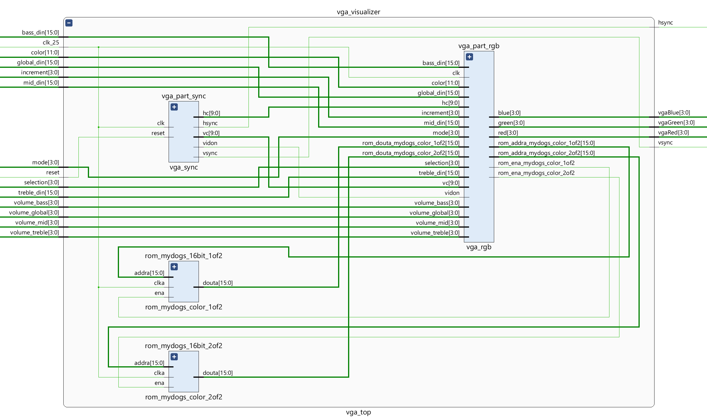
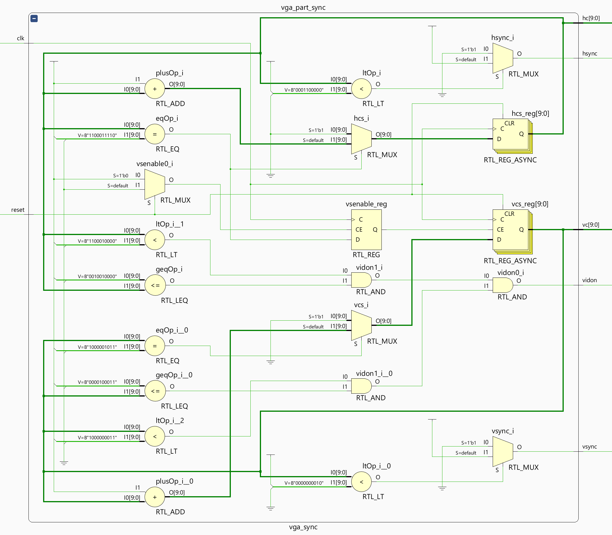
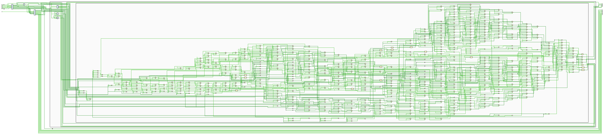

# VGA Visualizer

## Table of Contents

1. **[Introduction](#introduction)**

2. **[Explaining the Functionality](#explaining-the-functionality)**

3. **[Troubleshooting](#troubleshooting)**

## Introduction

TO DO

### Components

- VGA Visualizer (vga_top.vhd)
  - Synchronization: providing the correctly timed synchronization for a 60Hz 640x480px VGA monitor. (vga_sync.vhd)
  - Visuals: reading inputs and ROM, and deciding the visuals to output. (vga_rgb.vhd)
  - 2x ROM: holds a 256x256px (16-bit address) RGB332 (2xHEX = 16-bit coefficients) photo split up in two seperate files. (Block Memory IP)

*Elaborated Design Schematic Entire Project in Vivado*

*Elaborated Design Schematic of VGA Visualizer Vivado*

##### VGA Synchronization

*Elaborated Design Schematic of VGA Synchronization Vivado*

##### VGA Visuals

This schematic is too big to view, but can always be viewed in Vivado.

*Elaborated Design Schematic of VGA Visuals Vivado*

##### ROM Block Memory

*Elaborated Design Schematic of ROM Block Memory Vivado*

## Explaining the Functionality

*Reproduceerbaarheid / Tutorial achtige uitleg zoals de slides van de cursus.*

TO DO

## Troubleshooting

*Ervaarde moeilijkheden / gevonden oplossingen*

TO DO
