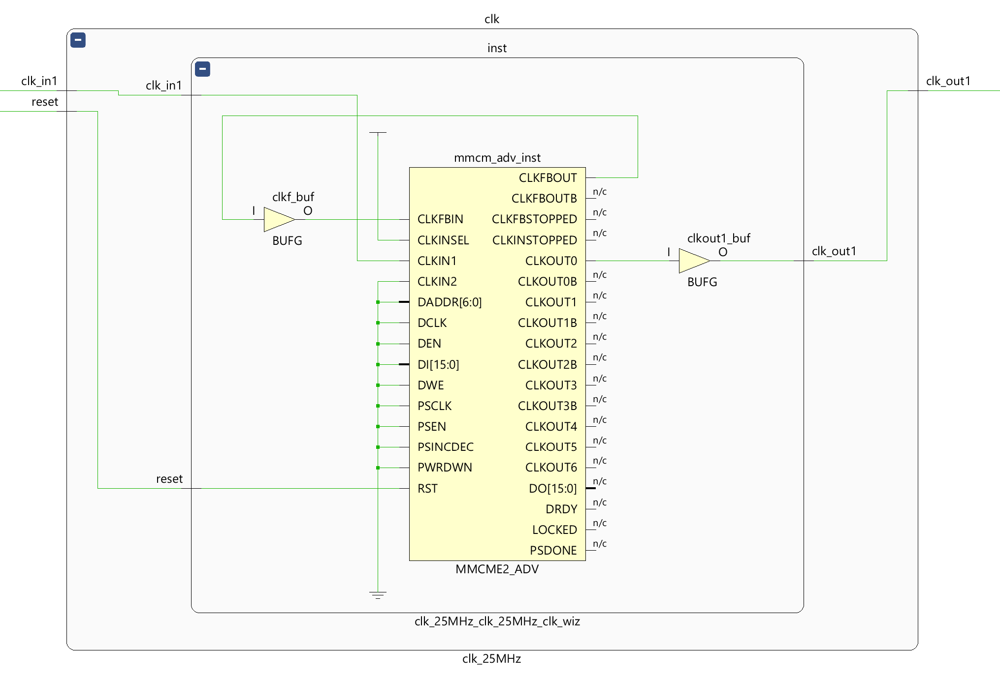

# VGA Visualizer

## Table of Contents

1. **[Introduction](#introduction)**

2. **[Explaining the Functionality](#explaining-the-functionality)**

3. **[Troubleshooting](#troubleshooting)**

---


## Introduction

This section covers all aspect that have to do with the visuals that are to be transmitted using the VGA standard.
The aim is to visualize the three seperate output audio bands and the median of all three, referred to as global, as well as their volume levels. As an extra touch an image is read from ROM and used as a background.

As an extra there are some additional visual modes:

- The 12-bit RGB444 color of VGA can be set with switches to see the color that corresponds with every combination.

- A grid mode, where you can visually check the correct synchronization of the VGA.

- A color palette where you can see color transitions.

- Basic image processing, like turning the color image to greyscale, adjusting the brightness, inverting the colors, and filtering out a specific channel.


*Mode 4: Audio Visualizer - Overview*

##### Screen Layout

- Left side: Global volume bar (background color set with switches, bar is inverted color)
- Right side: Three bands volume bars (bass, midrange and treble, in that order from left to right)
- Middle:
    - White: Global audio samples
    - Red: Bass audio samples
    - Green: Midrange audio samples
    - Blue: Treble audio samples
    - 512 x 480 background image

### Visual Modes

As an extra there are some additional visual modes:

  0. Mode <= '0000' - Color: Setting the background color with switches SW11-0.

  1. Mode <= "0001" - Color Grid: A grid is shown on the screen to verify synchronization accuracy.

  2. Mode <= "0011" - Color Palette: A color palette showing the color range of 12-bit RGB444, 4-bit Red channel, 4-bit Green channel and 4-bit Blue channel, the maximum amount of colors being available on VGA.

  3. Mode <= "0111" - Image Processing: A photo read from ROM is shown with a couple of basic image processing types applied which can be cycled through with selection Left/Right buttons.

  4. Mode <= "1111" - Audio Visualizer: Volume bars and the audio signals are shown with the photo read from ROM as background. Users can select the volume bars (Left/Right buttons) to increase or decrease the volume (Up/Down buttons).

---


### Components

- VGA Visualizer (vga_top.vhd)
  - Synchronization: providing the correctly timed synchronization for a 60Hz 640x480px VGA monitor. (vga_sync.vhd)
  - Visuals: reading inputs and ROM, and deciding the visuals to output. (vga_rgb.vhd)
  - 2x ROM: holds a 256x256px (16-bit address) RGB332 (2xHEX = 16-bit coefficients) photo split up in two seperate files. (Block Memory IP)


*Elaborated Design Schematic Entire Project in Vivado*


*Elaborated Design Schematic of VGA Visualizer Vivado*

##### VGA Synchronization


*Elaborated Design Schematic of VGA Synchronization Vivado*

##### VGA Visuals

This schematic is too big to view, but can always be viewed in Vivado.


*Elaborated Design Schematic of VGA Visuals Vivado*

##### ROM Block Memory IP


*Elaborated Design Schematic of ROM Block Memory Vivado*

##### Clocking Wizard IP



*Implementation Schematic of the Clocking Wizard in Vivado*

---


## Explaining the Functionality

The theory of VGA is well explained in lots of sources, so we won't go into it here.
Some excellent ones are:

  - [Diligent. (2019). Basys 3TM FPGA Board Reference Manual (Revised July 10, 2019 This manual applies to the Basys 3 rev. C) PDF](https://digilent.com/reference/_media/basys3:basys3_rm.pdf)

  - [Green, W. (2023, July 14). Beginning FPGA Graphics. Project F.](https://projectf.io/posts/fpga-graphics/)

  - [Green, W. (2021, October 19). Video timings: VGA, SVGA, 720p, 1080p. Project F.](https://projectf.io/posts/video-timings-vga-720p-1080p/)


*Actual VGA pixel size, Green, W.*

### Syncronization

The most important part of VGA is the synchronization. The specifications need to be followed (almost) exactly to get the correct results.
For this project the *VGA 640x480 60 Hz* specification are used, which are as follows:

```txt
Name          640x480p60
Standard      Historical
VIC                    1
Short Name       DMT0659
Aspect Ratio         4:3

Pixel Clock       25.175 MHz
TMDS Clock       251.750 MHz
Pixel Time          39.7 ns ±0.5%
Horizontal Freq.  31.469 kHz
Line Time           31.8 μs
Vertical Freq.    59.940 Hz
Frame Time          16.7 ms

Horizontal Timings
Active Pixels        640
Front Porch           16
Sync Width            96
Back Porch            48
Blanking Total       160
Total Pixels         800
Sync Polarity        neg

Vertical Timings
Active Lines         480
Front Porch           10
Sync Width             2
Back Porch            33
Blanking Total        45
Total Lines          525
Sync Polarity        neg

Active Pixels    307,200
Data Rate           0.60 Gbps

Frame Memory (Kbits)
 8-bit Memory      2,400
12-bit Memory      3,600
24-bit Memory      7,200
32-bit Memory      9,600
```

#### Clock (Clocking Wizard IP)

Most important for the timing and synchronization of VGA is the clock.
Ideally a 25,1748 MHz clock is needed, though a range from 25.0 MHz to 25.2 MHz is mostly acceptable.
This is calculated by multiplying the total screen size 800 by 525 pixels (not only the active pixels of 640 by 480) and the actual refreshrate of 59,940 Hz (~60Hz).

> 800 hpixels x 525 vpixels x 59,940 Hz = 25.174.800 Hz

The easiest way to achieve this is by using the Clocking Wizard in the Vivado IP Library.
The closest you can get is 25,17799 MHz.


*Clocking Wizard IP in Vivado*


*Implementation Schematic of the Clocking Wizard in Vivado*

```vhdl
component vga_sync is
    Port (
        clk : in STD_LOGIC;
        reset : in STD_LOGIC;
        hsync : out STD_LOGIC;
        vsync : out STD_LOGIC;
        hc : out STD_LOGIC_VECTOR (9 downto 0);
        vc : out STD_LOGIC_VECTOR (9 downto 0);
        vidon : out STD_LOGIC
    );
end component vga_sync;
```

```vhdl
--    640x480p60
--    Pixel Clock       25.175 MHz

--    Horizontal Timings
    --    Active Pixels        640
    --    Front Porch           16
    --    Sync Width            96
    --    Back Porch            48
    --    Blanking Total       160
    --    Total Pixels         800
    --    Sync Polarity        neg

    constant hpixels : STD_LOGIC_VECTOR (9 downto 0) := "1100011111"; -- 799 = Last pixel on line
    constant hsw : STD_LOGIC_VECTOR (9 downto 0) := "0001100000"; -- 96
    constant hbp : STD_LOGIC_VECTOR (9 downto 0) := "0010010000"; -- 96 + 48 = 144
    constant hfp : STD_LOGIC_VECTOR( 9 downto 0) := "1100010000"; -- 800 - 16 = 784

--    Vertical Timings
    --    Active Lines         480
    --    Front Porch           10
    --    Sync Width             2
    --    Back Porch            33
    --    Blanking Total        45
    --    Total Lines          525
    --    Sync Polarity        neg

    constant vlines : STD_LOGIC_VECTOR (9 downto 0) := "1000001100"; -- 524 = Last line on screen
    constant vsw : STD_LOGIC_VECTOR (9 downto 0) := "0000000010"; -- 2
    constant vbp : STD_LOGIC_VECTOR (9 downto 0) := "0000100011"; -- 2 + 33 = 35
    constant vfp : STD_LOGIC_VECTOR (9 downto 0) := "1000000011"; -- 525 - 10 = 515

    -- SIGNALS --

    signal hcs, vcs : STD_LOGIC_VECTOR(9 downto 0); -- These are the Horizontal and Vertical counters
    signal vsenable : STD_LOGIC; -- Enable for the Vertical counter
```

```vhdl
begin

    --Counter for the horizontal sync signal
    process(clk, reset)
    begin
        if reset = '1' then
            hcs <= "0000000000"; --
        elsif rising_edge(clk) then
            if hcs = hpixels - 1 then  --The counter has reached the end of pixel count
                hcs <= "0000000000"; --reset the counter
                vsenable <= '1';  --Enable the vertical counter  
            else
                hcs <= hcs + 1;  --Increment the horizontal counter
                vsenable <= '0';  --Leave the vsenable off
            end if;
       end if;
    end process;

    hsync <= '0' when hcs < hsw else '1'; --Horizontal Sync Pulse is low when hc is 0 - 96 (Horizontal Sync width = 96)

    --Counter for the vertical sync signal
    process(clk, reset, vsenable)
    begin
        if reset = '1' then
            vcs <= "0000000000";
        elsif rising_edge(clk) and vsenable='1' then --Increment when enabled
            if vcs = vlines - 1 then  --Reset when the number of lines is reached
                vcs <= "0000000000";
            else  
                vcs <= vcs + 1;  --Increment vertical counter
            end if;
        end if;
    end process;

    vsync <= '0' when vcs < vsw else '1';  --Vertical Sync Pulse is low when vc is 0 or 1  (Vertical Sync width = 2)

    --Enable video out when within the porches
    vidon <= '1' when (((hcs < hfp) and (hcs >= hbp))  
                      and ((vcs < vfp) and (vcs >= vbp))) else '0';  

    -- Output horizontal and vertical counters
    hc <= hcs;
    vc <= vcs;

end Behavioral;
```

### ROM Block Memory IP

ROM can be created by using the Block Memory IP in Vivado.


*Block Memory IP in Vivado - Basic Options*


*Block Memory IP in Vivado - Port A Options*


*Block Memory IP in Vivado - Other Options & .coe file*

To read the ROM the port A Enable (ena) must be set HIGH and the address to be read must be passed to Port A Address (addra). Now the the data on that address can be read out on the Data Output Port A (douta).

Note:

  - The pipelined Mux size is 16x1. Data wider than 16-bits will take additional clock cycles.

  - Only one coefficient, representing on pixel, can be read at a time.

```vhdl
component rom_mydogs_color_1of2 is
  Port (
    clka : in STD_LOGIC;
    ena : in STD_LOGIC;
    addra : in STD_LOGIC_VECTOR(15 downto 0);
    douta : out STD_LOGIC_VECTOR(15 downto 0)
  );
end component rom_mydogs_color_1of2;

component rom_mydogs_color_2of2 is
  Port (
    clka : in STD_LOGIC;
    ena : in STD_LOGIC;
    addra : in STD_LOGIC_VECTOR(15 downto 0);
    douta : out STD_LOGIC_VECTOR(15 downto 0)
  );
end component rom_mydogs_color_2of2;
```


*Elaborated Design Schematic of ROM Block Memory Vivado*

### Visuals

Drawing the visuals and reading from ROM mostly consists of lots and lots of if-statements and using the horizontal and vertical counters.

```vhdl
component vga_rgb is
    Port (
        clk : in STD_LOGIC;

        hc : in STD_LOGIC_VECTOR (9 downto 0);
        vc : in STD_LOGIC_VECTOR (9 downto 0);
        vidon : in STD_LOGIC;

        color : in STD_LOGIC_VECTOR (COLOR_WIDTH - 1 downto 0);
        mode : in STD_LOGIC_VECTOR (MODE_WIDTH - 1 downto 0);

        selection : in STD_LOGIC_VECTOR (SELECTION_WIDTH - 1 downto 0);
        increment : in STD_LOGIC_VECTOR (INCREMENT_WIDTH - 1 downto 0);

        volume_global : in STD_LOGIC_VECTOR (VOLUME_WIDTH - 1 downto 0);
        volume_bass : in STD_LOGIC_VECTOR (VOLUME_WIDTH - 1 downto 0);
        volume_mid : in STD_LOGIC_VECTOR (VOLUME_WIDTH - 1 downto 0);
        volume_treble : in STD_LOGIC_VECTOR (VOLUME_WIDTH - 1 downto 0);

        global_din : in STD_LOGIC_VECTOR (FIR_OUT_WIDTH - 1 downto 0);
        bass_din : in STD_LOGIC_VECTOR (FIR_OUT_WIDTH - 1 downto 0);
        mid_din : in STD_LOGIC_VECTOR (FIR_OUT_WIDTH - 1 downto 0);
        treble_din : in STD_LOGIC_VECTOR (FIR_OUT_WIDTH - 1 downto 0);

        rom_ena_mydogs_color_1of2 : out STD_LOGIC;
        rom_addra_mydogs_color_1of2 : out STD_LOGIC_VECTOR(15 downto 0);
        rom_douta_mydogs_color_1of2 : in STD_LOGIC_VECTOR(15 downto 0);

        rom_ena_mydogs_color_2of2 : out STD_LOGIC;
        rom_addra_mydogs_color_2of2 : out STD_LOGIC_VECTOR(15 downto 0);
        rom_douta_mydogs_color_2of2 : in STD_LOGIC_VECTOR(15 downto 0);

        blue : out STD_LOGIC_VECTOR (3 downto 0);
        green : out STD_LOGIC_VECTOR (3 downto 0);
        red : out STD_LOGIC_VECTOR (3 downto 0)
    );
end component vga_rgb;
```

Firstly, to make drawing of the images more practical and readable the horizontal and vertical counters are read to determine the pixels to be drawn by their x- and y-axis coordinates.

```vhdl
process (hc, vc)
begin
    if hc < hbp then
        x <= "0000000000";
    else
        x <= hc - hbp;
    end if;

    if vc < vbp then
        y <= "0000000000";
    else
        y <= vc - vbp;
    end if;
end process;
```

#### Mode 0: Color

In this mode you simply set the color being shown on the whole screen with the switches SW11-0.
With these the 12-bit RGB444 color is set and transmitted to the 12-bit RGB channels (4-bits each) of the VGA.
The background color of the following modes are set the same way.

```vhdl
if mode = "0000" and vidon = '1' then
    red <= color (3 downto 0);
    green <= color (7 downto 4);
    blue <= color (11 downto 8);
```


*Mode 0: Color - Overview*

#### Mode 1: Grid

To form a grid a single bit of the horizontal counter and vertical counter is checked.
If it is set HIGH a line is drawn. The spacing is dependend on which bit is checked.
Here bit positiion 1 is checked, resulting in spacing of two pixels.

```vhdl
elsif mode = "0001" and vidon = '1' then
    if hc(1) = '1' or vc(1) = '1' then
        red <= color (3 downto 0);
        green <= color (7 downto 4);
        blue <= color (11 downto 8);
    end if;
```


*Mode 1: Grid - Screen*

#### Mode 2: Color Palette

As a way to visualize the color posibilities of VGA and RGB444 this color palette was produced.

Note:

  - Expressions are reduced by working in reversed order. From what is drawn on the bottom right corner of the screen to the top left corner

  - When drawing to the screen, the last line in VHDL code wins and is drawn over what comes before.


*Mode 2: Color Palette - Screen*

##### Left side: Gradients

Top grey gradient has only 16 colors, repeats as to illustrate what is happening below.
The color gradient of each of the RGB channels has 16 dark tones and 16 light tones.

```vhdl
elsif mode = "0011" and vidon = '1' then

    greyscale <= x (6 downto 3);

    if x < 256 and x >= 128 then -- Bottom to top of the screen
        if y >= 360 then
            red <= greyscale;
            green <= greyscale;
            blue <= "1111";
        elsif y >= 240 then
            red <= greyscale;
            green <= "1111";
            blue <= greyscale;    
        elsif y >= 120 then
            red <= "1111";
            green <= greyscale;
            blue <= greyscale;
        elsif y >= 0 then
            red <= greyscale;
            green <= greyscale;
            blue <= greyscale;
        end if;
    elsif x < 128 then
        if y >= 360 then
            red <= "0000";
            green <= "0000";
            blue <= greyscale;
        elsif y >= 240 then
            red <= "0000";
            green <= greyscale;
            blue <= "0000";    
        elsif y >= 120 then
            red <= greyscale;
            green <= "0000";
            blue <= "0000";
        elsif y >= 0 then
            red <= greyscale;
            green <= greyscale;
            blue <= greyscale;
        end if;
    end if;
```

##### Top Right: Full Colors

Full 12-bit color palette of 4096 colors, without brightness adjustments.

```vhdl
    palette_x_up <= x (5 downto 2);
    palette_x_down <= reverse_4bit_counter(palette_x_up); -- Reverse counting from 0 -> 15 to 15 -> 0

    palette_y_up <= y (5 downto 2) + 2; -- +8 pixels
    palette_y_down <= reverse_4bit_counter(palette_y_up); -- Reverse counting from 0 -> 15 to 15 -> 0

    if x >= 256 and x < 640 then
        if x >= 576 then
            red <= "1111";
            green <= "0000";
            blue <= palette_x_down;
        elsif x >= 512 then
            red <= palette_x_up;
            green <= "0000";
            blue <= "1111";
        elsif x >= 448 then
            red <= "0000";
            green <= palette_x_down;
            blue <= "1111";
        elsif x >= 384 then
            red <= "0000";
            green <= "1111";
            blue <= palette_x_up;
        elsif x >= 320 then
            red <= palette_x_down;
            green <= "1111";
            blue <= "0000";
        else
            red <= "1111";
            green <= palette_x_up;
            blue <= "0000";
        end if;
    end if;
```

```vhdl
-- Make counter that counts up go down instead
function reverse_4bit_counter (input : in STD_LOGIC_VECTOR (3 downto 0))
    return STD_LOGIC_VECTOR is
        variable result : STD_LOGIC_VECTOR (input'range);
    begin
        case input is
            when "0000" =>
                result := "1111";
            when "0001" =>
                result := "1110";
            when "0010" =>
                result := "1101";
            when "0011" =>
                result := "1100";
            when "0100" =>
                result := "1011";
            when "0101" =>
                result := "1010";
            when "0110" =>
                result := "1001";
            when "0111" =>
                result := "1000";
            when "1000" =>
                result := "0111";
            when "1001" =>
                result := "0110";
            when "1010" =>
                result := "0101";
            when "1011" =>
                result := "0100";
            when "1100" =>
                result := "0011";
            when "1101" =>
                result := "0010";
            when "1110" =>
                result := "0001";
            when others => -- when "1111"
                result := "0000";
        end case;
        return result;
    end;
```

##### Bottom Right: Full Colors with Brightness Variations

The brigthness variations only succeeded partially without having to produce a gigantic LUT.

```vhdl
    palette_x_up <= x (5 downto 2);
    palette_x_down <= reverse_4bit_counter(palette_x_up); -- Reverse counting from 0 -> 15 to 15 -> 0

    palette_y_up <= y (5 downto 2) + 2; -- +8 pixels
    palette_y_down <= reverse_4bit_counter(palette_y_up); -- Reverse counting from 0 -> 15 to 15 -> 0

...

    if y > 415 then-- 479 - 46 = 415 -- White = more colors
        if x >= 256 and x < 640 then -- With gradient variations
            if x >= 576 then
                red <= "1111";
                green <= palette_y_up + 6;
                blue <= palette_x_down;
            elsif x >= 512 then
                red <= palette_x_up;
                green <= palette_y_up + 6;
                blue <= "1111";
            elsif x >= 448 then
                red <= palette_y_up + 6;
                green <= palette_x_down;
                blue <= "1111";
            elsif x >= 384 then
                red <= palette_y_up + 6;
                green <= "1111";
                blue <= palette_x_up;
            elsif x >= 320 then
                red <= palette_x_down;
                green <= "1111";
                blue <= palette_y_up + 6;
            else
                red <= "1111";
                green <= palette_x_up;
                blue <= palette_y_up + 6;
            end if;
        end if;
    elsif y >= 120 and y < 184 then -- Black = less colors
        if x >= 256 and x < 640 then -- With gradient variations
            if x >= 576 then
                red <= palette_y_up;
                green <= "0000";
                blue <= palette_x_down;
            elsif x >= 512 then
                red <= palette_x_up;
                green <= "0000";
                blue <= palette_y_up;
            elsif x >= 448 then
                red <= "0000";
                green <= palette_x_down; -- palette_x_down
                blue <= palette_y_up;
            elsif x >= 384 then
                red <= "0000";
                green <= palette_y_up;
                blue <= palette_x_up; -- palette_x_up
            elsif x >= 320 then
                red <= palette_x_down;
                green <= palette_y_up;
                blue <= "0000";
            else
                red <= palette_y_up;
                green <= palette_x_up; -- palette_x_up
                blue <= "0000";
            end if;
        end if;
    end if;
```

##### Right 2nd from Top: Background Color

```vhdl
    if x >= 256 and y >= 60 and y < 120 then
        -- Background color set with switches via color
        red <= color (3 downto 0);
        green <= color (7 downto 4);
        blue <= color (11 downto 8);
    end if;
```


#### Mode 3: Image Processing

Here we need to start reading from ROM.
The image is split into two parts to get higher fidelity while keeping the correct timing.
The image will be stretched over the vertical axis, so the image file is squizzed together vertically to compensate.


*Photo part 1of2*


*Photo part 2of2*

The Image Processing mode consists of:

 - Color (original)
 - Greyscale 1 Equation
 - Greyscale 2 Median
 - Inverted Colors
 - Brightness Up/Increase
 - Brightness Down/Decrease
 - Filtering Out Blue
 - Filtering Out Green
 - Filtering Out Red

```vhdl
elsif mode = "0111" and vidon = '1' then
    red <= color (11 downto 8);
    green <= color (7 downto 4);
    blue <= color (3 downto 0);
```

##### Color (original)

The image is read from ROM and show on screen.
The enable is set and the address given for the active pixel.
By using `y (8 downto 1)` instead of `y (7 downto 0)` the image is stretched vertically.

RGB332 is being used instead of the full RGB444 of VGA, so this needs to be compensated by concatinating extra bits at the LSB.

```vhdl
    -- Color
    if selection = "0000" then
        if x >= 64 and x < 256 + 64 then
            rom_ena_mydogs_color_1of2 <= '1';
            rom_addra_mydogs_color_1of2 <= y (8 downto 1) + 2 & x (7 downto 0) - 62; -- x-64 gives seem, y+0 gives artifact at top

            red <= rom_douta_mydogs_color_1of2 (7 downto 5) & '0';
            green <= rom_douta_mydogs_color_1of2 (4 downto 2) & '0';
            blue <= rom_douta_mydogs_color_1of2 (1 downto 0) & "01";

        elsif x >= 256 + 64 and x < 512 + 64 then
            rom_ena_mydogs_color_2of2 <= '1';
            rom_addra_mydogs_color_2of2 <= y (8 downto 1) + 2 & x (7 downto 0) - 62;

            red <= rom_douta_mydogs_color_2of2 (7 downto 5) & '0';
            green <= rom_douta_mydogs_color_2of2 (4 downto 2) & '0';
            blue <= rom_douta_mydogs_color_2of2 (1 downto 0) & "01";
        end if;
```


*Mode 3: Image Processing - Color*

##### Greyscale 1: Equation

Here, greyscale is achieved more weight to certain bits and color channels than others.
This preserves more detail in the shadows and has a high contrast overall.

```vhdl

-- Greyscale 1
elsif selection = "0001" then
if x >= 64 and x < 256 + 64 then
    rom_ena_mydogs_color_1of2 <= '1';
    rom_addra_mydogs_color_1of2 <= y (8 downto 1) + 2 & x (7 downto 0) - 62; -- x-64 gives seem, y+0 gives artifact at top

    r <= '0' & rom_douta_mydogs_color_1of2 (7 downto 5) & '0';
    g <= '0' & rom_douta_mydogs_color_1of2 (4 downto 2) & '0';
    b <= '0' & rom_douta_mydogs_color_1of2 (1 downto 0) & "01";

    -- (tred >> 2) + (tred >> 5) + (tgreen >> 1) + (tgreen >> 4)+ (tblue >> 4) + (tblue >> 5);
    grey <= "000000" + STD_LOGIC_VECTOR(shift_right(unsigned(r), 1)) + STD_LOGIC_VECTOR(shift_right(unsigned(r), 2)) + STD_LOGIC_VECTOR(shift_right(unsigned(g), 0)) + STD_LOGIC_VECTOR(shift_right(unsigned(g), 1)) + STD_LOGIC_VECTOR(shift_right(unsigned(b), 3)) + STD_LOGIC_VECTOR(shift_right(unsigned(b), 3));

    red <= grey (5 downto 2);
    green <= grey (5 downto 2);
    blue <= grey (5 downto 2);

elsif x >= 256 + 64 and x < 512 + 64 then
    rom_ena_mydogs_color_2of2 <= '1';
    rom_addra_mydogs_color_2of2 <= y (8 downto 1) + 2 & x (7 downto 0) - 62;

    r <= '0' & rom_douta_mydogs_color_2of2 (7 downto 5) & '0';
    g <= '0' & rom_douta_mydogs_color_2of2 (4 downto 2) & '0';
    b <= '0' & rom_douta_mydogs_color_2of2 (1 downto 0) & "01";

    grey <= "000000" + STD_LOGIC_VECTOR(shift_right(unsigned(r), 1)) + STD_LOGIC_VECTOR(shift_right(unsigned(r), 2)) + STD_LOGIC_VECTOR(shift_right(unsigned(g), 0)) + STD_LOGIC_VECTOR(shift_right(unsigned(g), 1)) + STD_LOGIC_VECTOR(shift_right(unsigned(b), 3)) + STD_LOGIC_VECTOR(shift_right(unsigned(b), 3));

    red <= grey (5 downto 2);
    green <= grey (5 downto 2);
    blue <= grey (5 downto 2);
end if;
```


*Mode 3: Image Processing - Greyscale 1 - Equation*

##### Greyscale 2: Median

Here, greyscale is achieved by using the median of all three channels on all channels.
This results in a lighter balanced image.

```vhdl
-- Greyscale 2
elsif selection = "0010" then
if x >= 64 and x < 256 + 64 then
    rom_ena_mydogs_color_1of2 <= '1';
    rom_addra_mydogs_color_1of2 <= y (8 downto 1) + 2 & x (7 downto 0) - 62; -- x-64 gives seem, y+0 gives artifact at top

    r <= '0' & rom_douta_mydogs_color_1of2 (7 downto 5) & '0';
    g <= '0' & rom_douta_mydogs_color_1of2 (4 downto 2) & '0';
    b <= '0' & rom_douta_mydogs_color_1of2 (1 downto 0) & "01";

    grey <= "000001" + r + g + b;

    red <= grey (5 downto 2);
    green <= grey (5 downto 2);
    blue <= grey (5 downto 2);

elsif x >= 256 + 64 and x < 512 + 64 then
    rom_ena_mydogs_color_2of2 <= '1';
    rom_addra_mydogs_color_2of2 <= y (8 downto 1) + 2 & x (7 downto 0) - 62;

    r <= '0' & rom_douta_mydogs_color_2of2 (7 downto 5) & '0';
    g <= '0' & rom_douta_mydogs_color_2of2 (4 downto 2) & '0';
    b <= '0' & rom_douta_mydogs_color_2of2 (1 downto 0) & "01";

    grey <= "000001" + r + g + b;

    red <= grey (5 downto 2);
    green <= grey (5 downto 2);
    blue <= grey (5 downto 2);
end if;
```


*Mode 3: Image Processing - Greyscale 2 - Median*

##### Brightness Up/Increase

The brightness of an image can be increased by adding a constant value to all channels.
With addition of STD_LOGIC_VECTORS there is compensation needed for overflow.
The channel can already hold "1111" when the increment adds "1111".
The store the sum an extra bit is added to the width of this regiter, and overflow is corrected.

```vhdl
-- Brightness Up
elsif selection = "0011" then
if x >= 64 and x < 256 + 64 then
    rom_ena_mydogs_color_1of2 <= '1';
    rom_addra_mydogs_color_1of2 <= y (8 downto 1) + 2 & x (7 downto 0) - 62; -- x-64 gives seem, y+0 gives artifact at top

    r <= '0' & rom_douta_mydogs_color_1of2 (7 downto 5) & '0' + increment;
    g <= '0' & rom_douta_mydogs_color_1of2 (4 downto 2) & '0' + increment;
    b <= '0' & rom_douta_mydogs_color_1of2 (1 downto 0) & "01" + increment;

    if r > "01111" then
        r <= "01111";
    end if;
    if g > "01111" then
        g <= "01111";
    end if;
    if b > "01111" then
        b <= "01111";
    end if;

    red <= r (3 downto 0);
    green <= g (3 downto 0);
    blue <= b (3 downto 0);

elsif x >= 256 + 64 and x < 512 + 64 then
    rom_ena_mydogs_color_2of2 <= '1';
    rom_addra_mydogs_color_2of2 <= y (8 downto 1) + 2 & x (7 downto 0) - 62;

    r <= '0' & rom_douta_mydogs_color_2of2 (7 downto 5) & '0' + increment;
    g <= '0' & rom_douta_mydogs_color_2of2 (4 downto 2) & '0' + increment;
    b <= '0' & rom_douta_mydogs_color_2of2 (1 downto 0) & "01" + increment;

    if r > "01111" then
        r <= "01111";
    end if;
    if g > "01111" then
        g <= "01111";
    end if;
    if b > "01111" then
        b <= "01111";
    end if;

    red <= r (3 downto 0);
    green <= g (3 downto 0);
    blue <= b (3 downto 0);
end if;
```


*Mode 3: Image Processing - Brightness Increase*

##### Brightness Down/Decrease

The brightness of an image can be decreased by substracting a constant value of all channels.
With substraction of STD_LOGIC_VECTORS there is compensation needed for underflow.
Therefore the increment value is checked before it is substracted.
If the increment value is larger than the channel's value it is simply set to zero.

```vhdl
-- Brightness Down
elsif selection = "0100" then
if x >= 64 and x < 256 + 64 then
    rom_ena_mydogs_color_1of2 <= '1';
    rom_addra_mydogs_color_1of2 <= y (8 downto 1) + 2 & x (7 downto 0) - 62; -- x-64 gives seem, y+0 gives artifact at top

    r_temp <= '1' & rom_douta_mydogs_color_1of2 (7 downto 5) & '0';
    g_temp <= '1' & rom_douta_mydogs_color_1of2 (4 downto 2) & '0';
    b_temp <= '1' & rom_douta_mydogs_color_1of2 (1 downto 0) & "01";

    if increment > r_temp (3 downto 0) then
        r <= "00000";
    else
        r <= r_temp - increment;
    end if;

    if increment > g_temp (3 downto 0) then
        g <= "00000";
    else
        g <= g_temp - increment;
    end if;

    if increment > b_temp (3 downto 0) then
        b <= "00000";
    else
        b <= b_temp - increment;
    end if;

    red <= r (3 downto 0);
    green <= g (3 downto 0);
    blue <= b (3 downto 0);

elsif x >= 256 + 64 and x < 512 + 64 then
    rom_ena_mydogs_color_2of2 <= '1';
    rom_addra_mydogs_color_2of2 <= y (8 downto 1) + 2 & x (7 downto 0) - 62;

    r_temp <= '1' & rom_douta_mydogs_color_2of2 (7 downto 5) & '0';
    g_temp <= '1' & rom_douta_mydogs_color_2of2 (4 downto 2) & '0';
    b_temp <= '1' & rom_douta_mydogs_color_2of2 (1 downto 0) & "01";

    if increment > r_temp (3 downto 0) then
        r <= "00000";
    else
        r <= r_temp - increment;
    end if;

    if increment > g_temp (3 downto 0) then
        g <= "00000";
    else
        g <= g_temp - increment;
    end if;

    if increment > b_temp (3 downto 0) then
        b <= "00000";
    else
        b <= b_temp - increment;
    end if;

    red <= r (3 downto 0);
    green <= g (3 downto 0);
    blue <= b (3 downto 0);
end if;
```


*Mode 3: Image Processing - Brightness Decrease*

##### Inverted Colors

Invertinf the colors of an image is very easy thanks to the NOT-gate.

```vhdl
-- Inverted
elsif selection = "0101" then
if x >= 64 and x < 256 + 64 then
    rom_ena_mydogs_color_1of2 <= '1';
    rom_addra_mydogs_color_1of2 <= y (8 downto 1) + 2 & x (7 downto 0) - 62; -- x-64 gives seem, y+0 gives artifact at top

    red <= not rom_douta_mydogs_color_1of2 (7 downto 5) & '0';
    green <= not rom_douta_mydogs_color_1of2 (4 downto 2) & '0';
    blue <= not rom_douta_mydogs_color_1of2 (1 downto 0) & "01";

elsif x >= 256 + 64 and x < 512 + 64 then
    rom_ena_mydogs_color_2of2 <= '1';
    rom_addra_mydogs_color_2of2 <= y (8 downto 1) + 2 & x (7 downto 0) - 62;

    red <= not rom_douta_mydogs_color_2of2 (7 downto 5) & '0';
    green <= not rom_douta_mydogs_color_2of2 (4 downto 2) & '0';
    blue <= not rom_douta_mydogs_color_2of2 (1 downto 0) & "01";
end if;
```


*Mode 3: Image Processing - Inverted*

##### Filtering Out Red

Filtering out a specific color is similair to decreasing the brightness.
Only here the increment is only substracted from the channel that needs to be filtered out.

```vhdl
-- Red Filter
elsif selection = "0110" then
if x >= 64 and x < 256 + 64 then
    rom_ena_mydogs_color_1of2 <= '1';
    rom_addra_mydogs_color_1of2 <= y (8 downto 1) + 2 & x (7 downto 0) - 62; -- x-64 gives seem, y+0 gives artifact at top

    r_temp <= '1' & rom_douta_mydogs_color_1of2 (7 downto 5) & '0';
    g_temp <= '1' & rom_douta_mydogs_color_1of2 (4 downto 2) & '0';
    b_temp <= '1' & rom_douta_mydogs_color_1of2 (1 downto 0) & "01";

    if increment > r_temp (3 downto 0) then
        r <= "00000";
    else
        r <= r_temp - increment;
    end if;

    g <= g_temp;
    b <= b_temp;

    red <= r (3 downto 0);
    green <= g (3 downto 0);
    blue <= b (3 downto 0);

elsif x >= 256 + 64 and x < 512 + 64 then
    rom_ena_mydogs_color_2of2 <= '1';
    rom_addra_mydogs_color_2of2 <= y (8 downto 1) + 2 & x (7 downto 0) - 62;

    r_temp <= '1' & rom_douta_mydogs_color_2of2 (7 downto 5) & '0';
    g_temp <= '1' & rom_douta_mydogs_color_2of2 (4 downto 2) & '0';
    b_temp <= '1' & rom_douta_mydogs_color_2of2 (1 downto 0) & "01";

    if increment > r_temp (3 downto 0) then
        r <= "00000";
    else
        r <= r_temp - increment;
    end if;

    g <= g_temp;
    b <= b_temp;

    red <= r (3 downto 0);
    green <= g (3 downto 0);
    blue <= b (3 downto 0);
end if;
```


*Mode 3: Image Processing - Filtering Out Red*

##### Filtering Out Green

Filtering out a specific color is similair to decreasing the brightness.
Only here the increment is only substracted from the channel that needs to be filtered out.

```vhdl
-- Green Filter
elsif selection = "0111" then
if x >= 64 and x < 256 + 64 then
    rom_ena_mydogs_color_1of2 <= '1';
    rom_addra_mydogs_color_1of2 <= y (8 downto 1) + 2 & x (7 downto 0) - 62; -- x-64 gives seem, y+0 gives artifact at top

    r_temp <= '1' & rom_douta_mydogs_color_1of2 (7 downto 5) & '0';
    g_temp <= '1' & rom_douta_mydogs_color_1of2 (4 downto 2) & '0';
    b_temp <= '1' & rom_douta_mydogs_color_1of2 (1 downto 0) & "01";

    if increment > g_temp (3 downto 0) then
        g <= "00000";
    else
        g <= g_temp - increment;
    end if;

    r <= r_temp;
    b <= b_temp;

    red <= r (3 downto 0);
    green <= g (3 downto 0);
    blue <= b (3 downto 0);

elsif x >= 256 + 64 and x < 512 + 64 then
    rom_ena_mydogs_color_2of2 <= '1';
    rom_addra_mydogs_color_2of2 <= y (8 downto 1) + 2 & x (7 downto 0) - 62;

    r_temp <= '1' & rom_douta_mydogs_color_2of2 (7 downto 5) & '0';
    g_temp <= '1' & rom_douta_mydogs_color_2of2 (4 downto 2) & '0';
    b_temp <= '1' & rom_douta_mydogs_color_2of2 (1 downto 0) & "01";

    if increment > g_temp (3 downto 0) then
        g <= "00000";
    else
        g <= g_temp - increment;
    end if;

    r <= r_temp;
    b <= b_temp;

    red <= r (3 downto 0);
    green <= g (3 downto 0);
    blue <= b (3 downto 0);
end if;
```


*Mode 3: Image Processing - Filtering Out Green*

##### Filtering Out Blue

Filtering out a specific color is similair to decreasing the brightness.
Only here the increment is only substracted from the channel that needs to be filtered out.

```vhdl
-- Blue Filter
elsif selection = "1000" then
if x >= 64 and x < 256 + 64 then
    rom_ena_mydogs_color_1of2 <= '1';
    rom_addra_mydogs_color_1of2 <= y (8 downto 1) + 2 & x (7 downto 0) - 62; -- x-64 gives seem, y+0 gives artifact at top

    r_temp <= '1' & rom_douta_mydogs_color_1of2 (7 downto 5) & '0';
    g_temp <= '1' & rom_douta_mydogs_color_1of2 (4 downto 2) & '0';
    b_temp <= '1' & rom_douta_mydogs_color_1of2 (1 downto 0) & "01";

    if increment > b_temp (3 downto 0) then
        b <= "00000";
    else
        b <= b_temp - increment;
    end if;

    r <= r_temp;
    g <= g_temp;

    red <= r (3 downto 0);
    green <= g (3 downto 0);
    blue <= b (3 downto 0);

elsif x >= 256 + 64 and x < 512 + 64 then
    rom_ena_mydogs_color_2of2 <= '1';
    rom_addra_mydogs_color_2of2 <= y (8 downto 1) + 2 & x (7 downto 0) - 62;

    r_temp <= '1' & rom_douta_mydogs_color_2of2 (7 downto 5) & '0';
    g_temp <= '1' & rom_douta_mydogs_color_2of2 (4 downto 2) & '0';
    b_temp <= '1' & rom_douta_mydogs_color_2of2 (1 downto 0) & "01";

    if increment > b_temp (3 downto 0) then
        b <= "00000";
    else
        b <= b_temp - increment;
    end if;

    r <= r_temp;
    g <= g_temp;

    red <= r (3 downto 0);
    green <= g (3 downto 0);
    blue <= b (3 downto 0);
end if;
```


*Mode 3: Image Processing - Filtering Out Blue*

#### Mode 4: Audio Visualizer


*Mode 4: Audio Visualizer - Screen*

##### Screen Layout

- Left side: Global volume bar (background color set with switches, bar is inverted color)
- Right side: Three bands volume bars (bass, midrange and treble, in that order from left to right)
- Middle:
    - White: Global audio samples
    - Red: Bass audio samples
    - Green: Midrange audio samples
    - Blue: Treble audio samples
    - 512 x 480 background image

##### Background Color

```vhdl
elsif mode = "1111" and vidon = '1' then
    red <= color (11 downto 8);
    green <= color (7 downto 4);
    blue <= color (3 downto 0);
```

##### Background Image

```vhdl
    if x >= 64 and x < 256 + 64 then
        rom_ena_mydogs_color_1of2 <= '1';
        rom_addra_mydogs_color_1of2 <= y (8 downto 1) + 2 & x (7 downto 0) - 62; -- x-64 gives seem, y+0 gives artifact at top

        red <= rom_douta_mydogs_color_1of2 (7 downto 5) & '0';
        green <= rom_douta_mydogs_color_1of2 (4 downto 2) & '0';
        blue <= rom_douta_mydogs_color_1of2 (1 downto 0) & "01";

    elsif x >= 256 + 64 and x < 512 + 64 then
        rom_ena_mydogs_color_2of2 <= '1';
        rom_addra_mydogs_color_2of2 <= y (8 downto 1) + 2 & x (7 downto 0) - 62;

        red <= rom_douta_mydogs_color_2of2 (7 downto 5) & '0';
        green <= rom_douta_mydogs_color_2of2 (4 downto 2) & '0';
        blue <= rom_douta_mydogs_color_2of2 (1 downto 0) & "01";
    end if;
```

##### Left Side: Global Volume vertical bar

The volume bars use the inverted background color to always have high contrast and good visibility.
The input volume is bit shifted five to the left, so one increment in volume represents 32 pixels of the volume bar.

> 32 x 15 = 480

To draw the bar the y-coordinate simply needs to be high or equal to the vertical size of the screen minus the shifted volume value. It works from the bottom up while the counter goes from top to bottom.

The bar is 64 pixels wide with 8 pixel gaps on both sides.

```vhdl
volume_global_shift <= volume_global & "00000";

    ...

    if x >= 8 and x < 64 - 8 then
        if y >= 480 - volume_global_shift then
            red <= not color (11 downto 8);
            green <= not color (7 downto 4);
            blue <= not color (3 downto 0);
        end if;
    end if;
```

##### Left Side: Bands Volume vertical bars

Same as Global Volume bar, but three thinner bars of 11 pixels each.

```vhdl
volume_bass_shift <= volume_bass & "00000";
volume_mid_shift <= volume_mid & "00000";
volume_treble_shift <= volume_treble & "00000";

...


-- Bottom: Band 1 - Bass Volume
       if  x >= 640 - 64 + 8 and x < 640 - 64 + 8 + 11 then
           if y >= 480 - volume_bass_shift then
               red <= not color (11 downto 8);
               green <= not color (7 downto 4);
               blue <= not color (3 downto 0);
           end if;
       end if;

       -- Middle: Band 2 - Midrange Volume
       if  x >= 640 - 64 + 8 + 11 + 8 and x < 640 - 64 + 8 + 11 + 8 + 11 then
           if y >= 480 - volume_mid_shift then
               red <= not color (11 downto 8);
               green <= not color (7 downto 4);
               blue <= not color (3 downto 0);
           end if;
       end if;

       -- Top: Band 3 - Treble Volume
       if  x >= 640 - 64 + 8 + 11 + 8 + 11 + 8 and x < 640 - 64 + 8 + 11 + 8 + 11 + 8 + 11 then
           if y >= 480 - volume_treble_shift then
               red <= not color (11 downto 8);
               green <= not color (7 downto 4);
               blue <= not color (3 downto 0);
           end if;
       end if;
```

##### Audio Samples

Four seperate bars, from left to right: Global, Bass, Midrange and Treble.
Each 118 pixels in width with 8 pixel gaps, drawn over the area of the background image.

```vhdl
    -- Global: Median of the three bands
    if x >= 64 + 8 and x < 64 + 8 + 118 then
        if y > 480 - global_din (15 downto 3) then
            red <= "1111";
            green <= "1111";
            blue <= "1111";
        end if;
    end if;

    -- Left: Band 1 - Bass Amplitude
    if x >= 64 + 8 + 118 + 8 and x < 64 + 8 + 118 + 8 + 118 then
        if y > 480 - bass_din (15 downto 3) then
            red <= "1111";
            green <= "0000";
            blue <= "0000";
        end if;
    end if;

    -- Middle: Band 2 - Midrange Amplitude
    if x >= 64 + 8 + 118 + 8 + 118 + 8 and x < 64 + 8 + 118 + 8 + 118 + 8 + 118 then
        if y > 480 - mid_din (15 downto 3) then
            red <= "0000";
            green <= "1111";
            blue <= "0000";
        end if;
    end if;

    -- Right: Band 3 - Treble Amplitude
    if x >= 64 + 8 + 118 + 8 + 118 + 8 + 118 + 8 and x < 576 - 8 then -- Between x 408 and 316
        if y > 480 - treble_din (15 downto 3) then
            red <= "0000";
            green <= "0000";
            blue <= "1111";
    end if;
end if;
```


---


## Troubleshooting

### Synchronization

I started off with the *Educational_demo_vga_keyboard*. However, I didn't quite understand all the numbers involved. After some testing by producing a grid on screen and playing with the VGA specification numbers, I came to the conclussion that the Demo doesn't uses all the correct specs.
This results in uneven spacing of the lines, and a space at the top and right side of the screen that is either empty or partially filled with what should be there.
This behaviour is the result of the vertical front and back porch being only 4 to short. The spec for Vertical Back Porch used being only 29 while it should be 33.

```vhdl
constant hpixels : STD_LOGIC_VECTOR (9 downto 0) := "1100100000"; -- 800
constant vlines : STD_LOGIC_VECTOR (9 downto 0) := "1000001001"; -- 521

constant hbp: std_logic_vector(9 downto 0) := "0010010000"; -- Horizontal back porch = 144 (128+16)
constant hfp: std_logic_vector(9 downto 0) := "1100010000"; -- Horizontal front porch = 784 (128+16+640)
constant vbp: std_logic_vector(9 downto 0) := "0000011111"; -- Vertical back porch = 31 (2+29)
constant vfp: std_logic_vector(9 downto 0) := "0111111111"; -- Vertical front porch = 511 (2+29+480)
```

This is clearly visible in the grid visual, as shown below:


*Grid 2px, Educational_demo_vga_keyboard*


*Grid 2px Close-up, Educational_demo_vga_keyboard*


*Grid 1px, Educational_demo_vga_keyboard*


*Grid 1px Close-up, Educational_demo_vga_keyboard*

##### Correct Specs

```vhdl
--    Horizontal Timings
    --    Active Pixels        640
    --    Front Porch           16
    --    Sync Width            96
    --    Back Porch            48
    --    Blanking Total       160
    --    Total Pixels         800
    --    Sync Polarity        neg

    constant hpixels : STD_LOGIC_VECTOR (9 downto 0) := "1100011111"; -- 799 = Last pixel on line
    constant hsw : STD_LOGIC_VECTOR (9 downto 0) := "0001100000"; -- 96
    constant hbp : STD_LOGIC_VECTOR (9 downto 0) := "0010010000"; -- 96 + 48 = 144
    constant hfp : STD_LOGIC_VECTOR( 9 downto 0) := "1100010000"; -- 800 - 16 = 784

--    Vertical Timings
    --    Active Lines         480
    --    Front Porch           10
    --    Sync Width             2
    --    Back Porch            33
    --    Blanking Total        45
    --    Total Lines          525
    --    Sync Polarity        neg

    constant vlines : STD_LOGIC_VECTOR (9 downto 0) := "1000001100"; -- 524 = Last line on screen
    constant vsw : STD_LOGIC_VECTOR (9 downto 0) := "0000000010"; -- 2
    constant vbp : STD_LOGIC_VECTOR (9 downto 0) := "0000100011"; -- 2 + 33 = 35
    constant vfp : STD_LOGIC_VECTOR (9 downto 0) := "1000000011"; -- 525 - 10 = 515
```

Resulting in:


*VGA Sync Correction*


*VGA Sync Correction close-up*

### Showing Images from ROM

With reading from ROM on the Digilent Basys 3 Artix-7 FPGA Trainer Board you have to make sure that all signals are 8-bit or 16-bits. Otherwise you get timing issues due to extra clock cycles that are needed to read the memory, resulting in the image not being shown correctly.
This means practically that:

  - The coefficients in RGB444 don't work. You can convert them too RGB332 using only 2xHEX or 16-bit Binary per pixel. 16-bit RGB565 could also be possible, but this has not been tested, and is overkill since VGA maximaly takes RGB444. So it is a waste of memory usage.

  - The image size can be no larger than 256 (8-bit) by 256 (8-bit), because the memory address of a single pixel is its coordinate on x- and y-axis (8-bit + 8-bit) and the pipelined Mux size is 16x1.

This is why I ended up seperating my photo into two 8-bit RGB332 256x256px .coe files to get the best possible image quality. The y-axis is stretched out so the combined image actually spans 512x512px and goes off screen at the bottom.
These two files already take in 64% of the available BRAM, so splitting it up further into four files, to not having to stretch the image, is not possible.


*Final two part image with gap*

##### Work In Progress Photos


*Reading image from ROM WIP 1*


*Reading image from ROM WIP 2*


*Reading image from ROM WIP 3*


*Reading image from ROM WIP 4*


*Reading image from ROM WIP 5*


*Reading image from ROM WIP 6*

### Calculations with STD_LOGIC_VECTORS

In the Image Processing mode especially, but also in the timing of the images, I had some difficulties with operations by working with STD_LOGIC_VECTORS. You also can't cast in if-statement expression. So extra registers in between are sometimes needed, but can mess with the timing.

### More Advanced Image processing

More advanced image processing requires pixels to be read that are not currently active to be used in calculations and written back to RAM. This is timing wise not possible in the current implementation of the VGA Visuals `vga_rgb.vhd`, but might be possible in a seperate component using the 100MHz clock instead of 25MHz.
